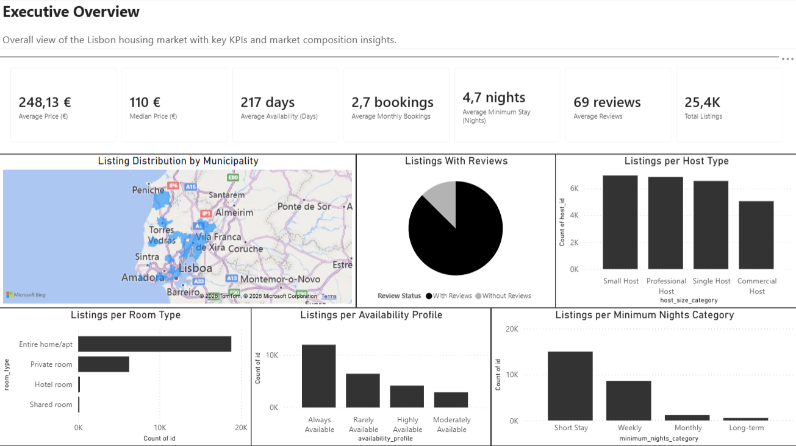
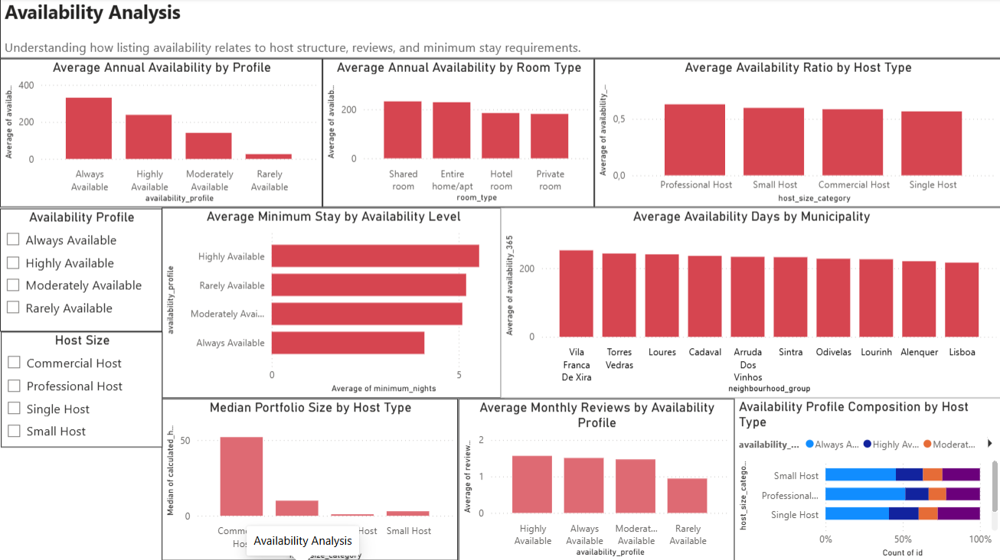
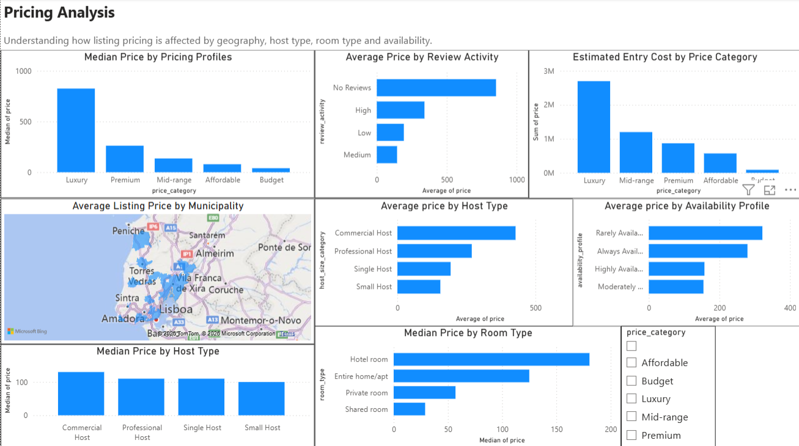
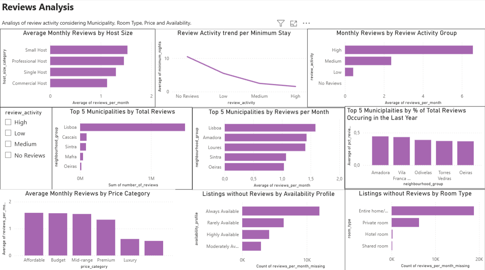

# Lisbon Housing Market - Data Engineering & Analysis
**Author:** Elton Silva

## Overview

This project performs an end-to-end analysis of the Lisbon housing market using Python, SQL, and Power BI.
The analysis uses a 2025 snapshot of the Lisbon housing market dataset.
The objective is to understand housing dynamics across Lisbon municipalities by analyzing:

- pricing differences
- estimated demand
- host characteristics
- availability patterns
- review activity

The project includes:

- automated data cleaning pipeline
- feature engineering
- SQL business analysis
- interactive Power BI dashboard

## Key Insights

- Lisbon city had the highest listing volume with over 17,000 listings.
- Cascais showed premium pricing relative to surrounding municipalities.
- Professional hosts tend to charge higher average prices.
- Listings with lower availability generally exhibit stronger review activity, suggesting higher occupancy.

## Tech Stack

### Languages
- Python 3.10
- SQL

### Libraries
- Pandas
- NumPy
- Matplotlib
- Seaborn

### Data Storage
- SQLite

### Visualization
- Power BI

### Development
- VS Code
- Git

## Commands:
To run the data engineering pipeline:
```bash
python -m root.src.pipeline
```

To create the database:
```bash
python root/sql/listings_db.py
```

## File Structure
```text
- root:
    - dashboard:
        - listings_dashboard.pbix
    - data:
        - processed:
            - listings_data_clean.csv
        - raw:
            - calendar.csv.gz
            - listings.csv
            - listings.csv.gz
            - neighbourhoods.csv
            - neighbourhoods.geojson
            - reviews.csv
            - reviews.csv.gz
    - notebooks:
        - Data_exploration.ipynb
    - sql:
        - listings_db.py
        - queries.sql
    - src:
        - __init__.py
        - .gitignore
        - data_cleaning.py
        - feature_engineering.py
        - pipeline.py
        - validation.py
    - visuals:
        - dashboard_screenshots:
            - Executive Overview.png
            - Availability Analysis.png
            - Pricing Analysis.png
            - Reviews Analysis.png
        - sql_outputs
    - __init__.py
    - README.md
    - requirements.txt
- lisbon_housing.db

## Dashboard Preview

### Executive Overview


### Availability Analysis


### Pricing Analysis


### Reviews Analysis

```